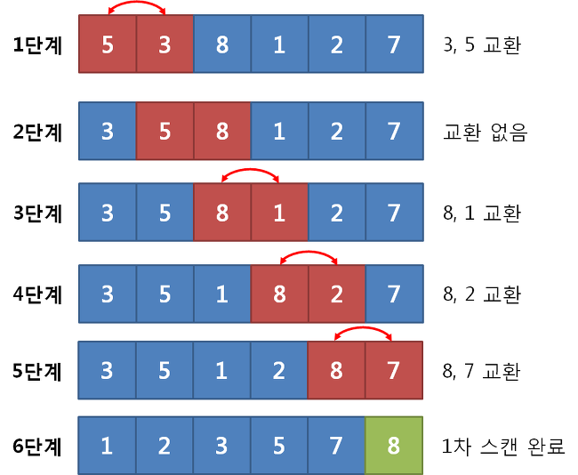

##  버블 정렬
• 단순히 인접한 두 원소를 확인하여, 정렬이 안 되어 있다면 위치를 서로 변경한다.
• 서로 인접한 두 원소를 비교하는 형태가 **거품**과 같다고 하여 붙여진 이름이다.
• 시간 복잡도 O(n^2)로 **비효율적인 정렬 알고리즘** 중 하나다.

---
## 버블 정렬 동작 방식
• 각 단계에서는 **인접한 두 개의 원소를 비교**하여, 필요시 위치를 변경한다.
• 첫째와 둘째를 비교, 둘째와 셋째를 비교, 셋째와 넷째를 비교하는 방식이다.
• 한 번의 단계가 수행되면, 가장 큰 원소가 맨 뒤로 이동한다.
• 따라서, **그 다음 단계에서는 맨 뒤로 이동한 데이터는 정렬에서 제외**한다.
> 💡 각 단계를 거칠 때마다 가장 큰 값을 하나씩 확실하게 결정하는 것으로 이해할 수 있다.

---
## 버블 정렬 예시


---
## 버블 정렬 소스 코드 예시

```js
function bubbleSort(arr) {
    for (let i = arr.length - 1; i > 0; i--) {
        for (let j = 0; j < i; j++) {
            if (arr[j] < arr[j + 1]) {
                let temp = arr[j];
                arr[j] = arr[j + 1];
                arr[j + 1] = temp;
            }
        }
    }
}
```

---
## 버블 정렬의 시간 복잡도
• 최악의 경우 시간 복잡도 O(n^2)을 보장한다.
• 이미 정렬된 배열에 대해서 모든 비교가 필요하므로, 굉장히 비효율적인 정렬 알고리즘 중 하나에 속한다