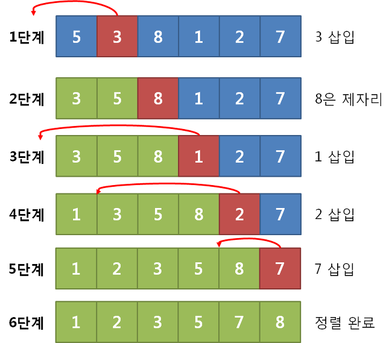

## 삽입 정렬
- 삽입 정렬이란 각 수(데이터)를 적절한 위치에 삽입하는 정렬 기법이다.

---

## 삽입 정렬 동작 방식
1. 각 단계에서 현재 원소가 삽입될 위치를 찾는다.
2. 적절한 위치에 도달할 때까지 반복적으로 왼쪽으로 이동한다
---

## 삽입 정렬 예시

---

## 삽입 정렬 소스 코드 예시
```js
function insertionSort(arr) {
    for (let i = 1; i < arr.length; i++) {
        for (let j = i; j > 0; j--) {
            // 인덱스 j부터 1까지 1씩 감소하며 반복
            if (arr[j] < arr[j - 1]) {
                // 한 칸씩 왼쪽으로 이동 스와프(swap)
                let temp = arr[j];
                arr[j] = arr[j - 1];
                arr[j - 1] = temp;
            } else {
                // 자기보다 작은 데이터를 만나면 그 위치에서 멈춤
                break;
            }
        }
    }
}
```

---
## 삽입 정렬의 시간 복잡도
• 삽입 정렬이란 각 원소를 적절한 위치에 **삽입**하는 정렬 기법이다.
• 매 단계에서 현재 처리 중인 원소가 삽입될 위치를 찾기 위해 약 𝑁번의 연산이 필요하다.
• 결과적으로 약 𝑁개의 단계를 거친다는 점에서 최악의 경우 𝑂(n^2) 의 시간 복잡도를 가진다.