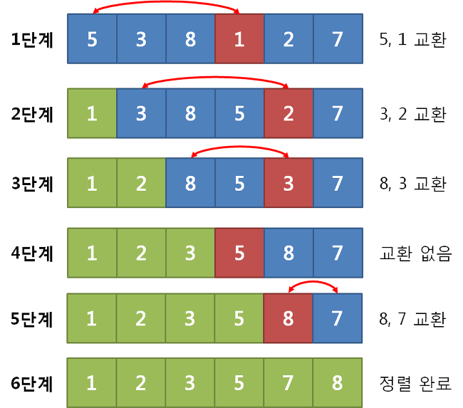

## 선택 정렬
• 선택 정렬은 매 단계에서 가장 작은 원소를 **선택**해서 앞으로 보내는 정렬 방법이다.
• 앞으로 보내진 원소는 더 이상 위치가 변경되지 않는다.
• 시간 복잡도 O(n^2)로 **비효율적인 정렬 알고리즘** 중 하나다.

---
## 선택 정렬 동작 방식
1. 각 단계에서 **가장 작은 원소**를 **선택**한다.
2. 현재까지 처리되지 않은 원소들 중 **가장 앞의 원소와 위치를 교체**한다

---
## 선택 정렬 예시


---
## 선택 정렬 소스 코드 예시

```js
function selectionSort(arr) {
    for (let i = 0; i < arr.length; i++) {
        let minIndex = i; // 가장 작은 원소의 인덱스
        for (let j = i + 1; j < arr.length; j++) {
            if (arr[minIndex] > arr[j]) {
                minIndex = j;
            }
        }
        // swap
        let temp = arr[i];
        arr[i] = arr[minIndex];
        arr[minIndex] = temp;
    }
}
```

---
## 선택 정렬의 시간 복잡도
• 선택 정렬이란 **가장 작은 것을 선택해서 앞으로 보내는 정렬 기법**이다.
• 매 단계에서 가장 작은 것을 선택하는 데에 약 𝑁번의 연산이 필요하다. (선형 탐색)
• 결과적으로 약 𝑁개의 단계를 거친다는 점에서 최악의 경우 O(n^2)의 시간 복잡도를 가진다.